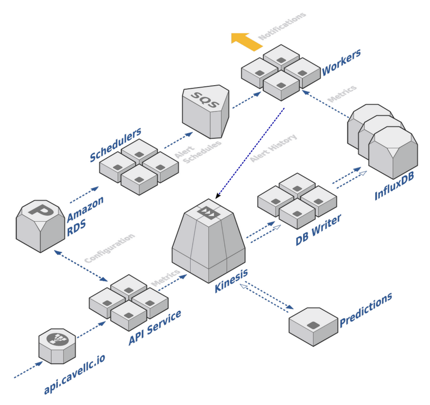

## Architecture

CAVE has been designed around [AWS](http://aws.amazon.com) infrastructure.

To make it fully scalable, we deploy each module as an Auto Scaling group, and use Elastic Load Balancers to distribute traffic to each node.

We are using Amazon Kinesis to transport the metric data around. The API Service stores raw metric data into Kinesis, which is then read by the DB Writer Service and persisted into the metric data store, an InfluxDB cluster. The decoupling of the data makes it possible to add new modules which can read existing data and create new data. For example, a Prediction module (not yet available) could read raw metric data and generate predictions, which in turn it could store into Kinesis. The predicted data would also be read by DB Writers and persisted to InfluxDB.

The configuration data is persisted into a Postgres database. We are using Amazon RDS for this, and the Scheduler Service reads this configuration and generates alert schedules, which it writes into Amazon SQS. The Worker Service instances read schedules from SQS, evaluate them using data from InfluxDB, and generate notifications as needed. The Worker Service instances also produce Alert History data, which is stored back into Kinesis, to be persisted into InfluxDB by the DB Writer Service. In this manner, alert history also becomes metric data, so that it can be queried through the same API as any other metric data.